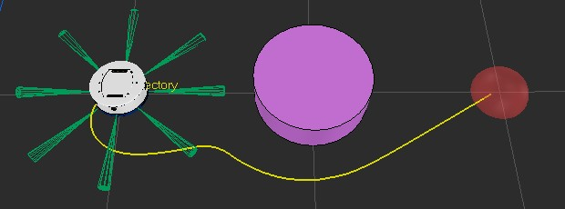

# Ambiente con Obstaculos

Para ejecutar la simulacion con obstaculos se debe abrir el archivo 'Obstacle_index_graphs - roud.ttt', si este archivo se abre se deberia observar una imagen similar a la que se muestra a continuación

Despues de haber abierto exitosamente la escena de Coppelia, para ejecutar el programa que realice el control de posición sobre el robot movil, se pueden elegir 3 controladores distintos
'IPC_obst.py'

'Villela_obst.py'

'NeuroE.py'

Cualquiera de los 3 controladores mencionados, son programas de python, y consecuentemente para ejecutarlos se ejecutan como un archivo de python normal. Para ejecutar un archivo de Python se debe abrir la ventana de comandos, 'comand prompt' o 'Simbolo del sistema', adentro de la ventana de comandos se debe navegar hasta la ubicación del archivo, y finalmente escribir 'python IPC.py'.

Nota: Primero se debe abrir la escena de Coppelia y luego se ejecutar el archivo de python
