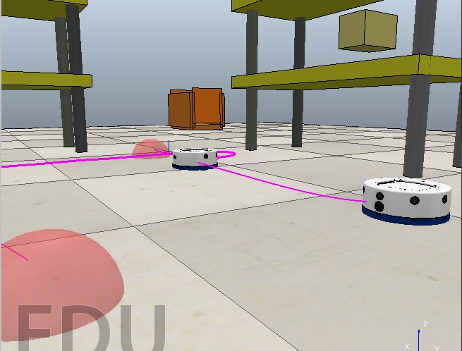

# Khepera - Felipe Mercado
Este proyecto se trata sobre robots moviles y se presentan varias simulaciones de la plataforma robotica kheperas, para ello se utiliza el Software CoppeliaSim y el lenguaje de programación Python

Existen 3 carpetas: 'Sin obstaculos', 'Con Obstaculos' y 'Multiples robots moviles', adentro de cada carpeta se encuentra una simulación distinta. Para ejecutar cualquiera de las simulaciones es necesario tener instalado el programa Coppelia Sim (https://www.coppeliarobotics.com/) y Python (https://www.python.org/), hay más información sobre las simulaciones adentro de cada carpeta

Muchas gracias por visitar este repositorio! :D
