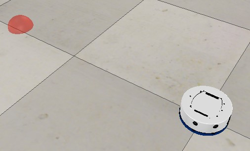

# Ambiente sin obstaculos

Para ejecutar la simulacion sin obstaculos se debe abrir el archivo 'KheperaPosition-V1_Scene.ttt', si este archivo se abre se deberia observar una imagen similar a la que se muestra a continuación

Despues de haber abierto exitosamente la escena de Coppelia, para ejecutar el programa que realice el control de posición sobre el robot movil, se pueden elegir 3 controladores distintos
--'IPC.py'
--'Villela.py'
--'NeuroE.py'
jeje

